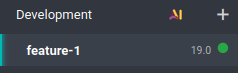
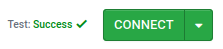
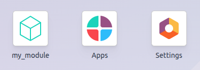

===============
Create a module
===============

Before creating your first module, it is necessary to :doc:`create an Odoo.sh project
<getting_started/create>` and knowing your GitHub repository's URL.

.. admonition:: Glossary

   - `~/src` is the directory where the Git repositories related to your Odoo projects are located.
   - `odoo` is the GitHub user.
   - `odoo-addons` is the GitHub repository.
   - `feature-1` is the name of a development branch.
   - `main` is the name of the production branch.
   - `my_module` is the name of the module.

  Replace these as necessary.

.. _odoo-sh/module/development-branch:

Create the development branch
=============================

.. tabs::

   .. group-tab:: On Odoo.sh

      From the :doc:`Branches view <getting_started/branches>`:

      - In the branches navigation panel, click the ＋ (:guilabel:`New development
        branch`) button next to :guilabel:`Development`.
      - Under :guilabel:`Fork`, select the `main` branch.
      - Under :guilabel:`To`, enter `feature-1`.

      .. image:: create_module/development-branch-odoo-sh.png
         :alt: Forking the production branch to create a development branch on Odoo.sh

      Once the build is ready, you can access the :doc:`editor <getting_started/online_editor>` and
      the code of your development branch from the folder `~/src/user` folder.

   .. group-tab:: On a computer

      - Clone your GitHub repository on your computer by running the following commands:

        .. code-block:: bash

           mkdir ~/src
           cd ~/src
           git clone https://github.com/odoo/odoo-addons.git
           cd ~/src/odoo-addons

      - Create a new branch by running:

        .. code-block:: bash

           git checkout -b feature-1 main

.. _odoo-sh/module/module-structure:

Create the module structure
===========================

.. _odoo-sh/module/module-structure/scaffolding:

Scaffolding
-----------

While it is not required, scaffolding avoids the tedium of setting the basic Odoo module structure.
You can scaffold a new module using the `odoo-bin` executable.

.. tabs::

   .. group-tab:: On Odoo.sh

      From the :doc:`editor's <getting_started/online_editor>` terminal, run:

      .. code-block:: bash

         odoo-bin scaffold my_module ~/src/user/

   .. group-tab:: On a computer

      With :doc:`Odoo installed <../on_premise/source>` on your computer, run:

      .. code-block:: bash

         ./odoo-bin scaffold my_module ~/src/odoo-addons/

.. tip::
   If you do not want to install Odoo on your computer, you can also :download:`download this module
   structure template <create_module/my_module.zip>`. Replace every occurrences of `my_module` with
   the name of your choice.

The structure below will be generated:

::

  my_module
  ├── __init__.py
  ├── __manifest__.py
  ├── controllers
  │   ├── __init__.py
  │   └── controllers.py
  ├── demo
  │   └── demo.xml
  ├── models
  │   ├── __init__.py
  │   └── models.py
  ├── security
  │   ├── ir.model.access.csv
  │   └── models.py
  └── views
      ├── templates.xml
      └── views.xml

.. warning::
   Only use alphanumeric characters (`a-z`, `0-9`) or underscores (`_`) when naming your module, as
   its name is used for Python classes, and class names containing special characters other than
   underscores are not valid in Python.

Uncomment the following files:

- :file:`models/models.py` an example of a model with its fields
- :file:`views/views.xml` a tree and a form view, with the menus opening them
- :file:`demo/demo.xml` demo records for the example model
- :file:`controllers/controllers.py` an example of a controller implementing some routes
- :file:`views/templates.xml` two example qweb views used by the controller routes
- :file:`__manifest__.py` the manifest of your module, including its title, description and data
  files to load. Uncomment the access control list data file:

  .. code-block:: python

     # 'security/ir.model.access.csv',

.. _odoo-sh/module/module-structure/manually:

Manually
--------

To create your module structure manually, follow the
:doc:`/developer/tutorials/server_framework_101` tutorial to understand the structure of a module
and the content of each file.

.. _odoo-sh/module/push-development:

Push the development branch
===========================

#. Stage the changes to be committed by running:

   .. code-block:: bash

      git add my_module

#. Commit your changes by running:

   .. code-block:: bash

      git commit -m "My first module"

#. Push your changes to your remote repository by running:

   .. tabs::

      .. group-tab:: On Odoo.sh

         From the :doc:`editor's <getting_started/online_editor>` terminal, run:

         .. code-block:: bash

            git push https HEAD:feature-1

         .. seealso::
            :ref:`Online editor documentation: committing and pushing changes
            <odoo-sh/editor/commit>`

      .. group-tab:: On a computer

         Run:

         .. code-block:: bash

            git push -u origin feature-1

         It is only necessary to specify `-u origin feature-1` the first time you push. After that,
         run:

         .. code-block:: bash

            git push

.. _odoo-sh/module/test-module:

Test the module
===============

The branch should appear under the :guilabel:`Development` section of the :doc:`Branches view
<getting_started/branches>` navigation panel.

Click the branch name to access its history, such as the changes you just pushed, including the
comment you set. Once the database is ready, access it by clicking :guilabel:`Connect`.

If your Odoo.sh project is configured to install the module automatically, it will directly appear
on the database dashboard. Otherwise, it will be available for installation under the
:guilabel:`Apps` app.

.. _odoo-sh/module/test-production:

Test with the production data
=============================

.. note::
   A production database is required for this step. If you do not have one yet, create it.

Once you have tested the module in a development build with the demo data and believe it is ready,
you can test it with the production data using a staging branch.

You can:

- Make your development branch a staging branch by dragging and dropping it onto the
  :guilabel:`Staging` section.
- Merge it in an existing staging branch by dragging and dropping it onto the given staging branch.
- Use the `git merge` command to merge your branches.

This creates a new staging build, which duplicates the production database and make it run using a
server updated with your branch's latest changes.

Once the database is ready, access it by clicking :guilabel:`Connect`.

.. _odoo-sh/module/test-production/install:

Install the module
------------------

Install the module from the :guilabel:`Apps` app. As the module may not appear directly in the list
of apps, update the list of apps by activating the :ref:`developer mode <developer-mode>` and
clicking :menuselection:`Update Apps List --> Update`.

.. note::
   The module is not installed automatically, as the purpose of the staging build is to test the
   behavior of your changes as it would be on the production database, meaning you would not want
   a module to be installed automatically.

.. _odoo-sh/module/deploy:

Deploy in production
====================

Once you have tested the module in a staging branch with the production data and believe it is ready
for production, you cna merge your branch in the production branch by:

- Dragging and dropping the staging branch onto the production branch.
- Using the `git merge` command to merge your branches.

This merges the latest changes of the staging branch into the production branch, and updates the
production server with these latest changes.

Once the database is ready, access it by clicking :guilabel:`Connect`.

.. _odoo-sh/module/deploy/install:

Install the module
------------------

Install the module from the :guilabel:`Apps` app. As the module may not appear directly in the list
of apps, update the list of apps by activating the :ref:`developer mode <developer-mode>` and
clicking :menuselection:`Update Apps List --> Update`.

.. _odoo-sh/module/add:

Add a change
============

This section explains how to add a change in your module by adding a new field in a model and deploy
it.

#. From the :doc:`editor's <getting_started/online_editor>` or from your computer, browse to the
   module folder :file:`~/src/odoo-addons/my_module`, then open the :file:`models/models.py` file to
   edit it. After the description field:

   .. code-block:: python

      description = fields.Text()

   Add a datetime field:

   .. code-block:: python

      start_datetime = fields.Datetime('Start time', default=lambda self: fields.Datetime.now())

#. Open the :file:`views/views.xml` file and after:

   .. code-block:: xml

      <field name="value2"/>

   Add:

   .. code-block:: xml

      <field name="start_datetime"/>

These changes alter the database structure by adding a column in a table,
and modify a view stored in database.

In order to be applied in existing databases, such as your production database,
these changes requires the module to be updated.

If you would like the update to be performed automatically by the Odoo.sh platform when you push
your changes, increase your module version in its manifest.

Open the module manifest *__manifest__.py*.

Replace

.. code-block:: python

   'version': '0.1',

with

.. code-block:: python

  'version': '0.2',

The platform will detect the change of version and trigger the update of the module upon the new
revision deployment.

Browse to your Git folder.

Then, from an Odoo.sh terminal:

.. code-block:: bash

   cd ~/src/user/

Or, from your computer terminal:

.. code-block:: bash

   cd ~/src/odoo-addons/

Then, stage your changes to be committed

.. code-block:: bash

   git add my_module

Commit your changes

.. code-block:: bash

   git commit -m "[ADD] my_module: add the start_datetime field to the model my_module.my_module"

Push your changes:

From an Odoo.sh terminal:

.. code-block:: bash

   git push https HEAD:feature-1

Or, from your computer terminal:

.. code-block:: bash

   git push

The platform will then create a new build for the branch *feature-1*.

.. image:: first_module/firstmodule-test-addachange-build.png

Once you tested your changes, you can merge your changes in the production branch, for instance by
drag-and-dropping the branch on the production branch in the Odoo.sh interface. As you increased the
module version in the manifest, the platform will update the module automatically and your new field
will be directly available. Otherwise you can manually update the module within the apps list.

Use an external Python library
==============================

If you would like to use an external Python library which is not installed by default,
you can define a *requirements.txt* file listing the external libraries your modules depends on.

.. note::
   - It is not possible to install or upgrade system packages on an Odoo.sh database (e.g., apt
     packages). However, under specific conditions, packages can be considered for installation.
     This also applies to **Python modules** requiring system packages for their compilation, and
     **third-party Odoo modules**.
   - **PostgreSQL extensions** are not supported on Odoo.sh.
   - For more information, consult our `FAQ <https://www.odoo.sh/faq#install_dependencies>`_.

The platform will use this file to automatically install the Python libraries your project needs.

The feature is explained in this section by using the `Unidecode library
<https://pypi.python.org/pypi/Unidecode>`_ in your module.

Create a file *requirements.txt* in the root folder of your repository

From the Odoo.sh editor, create and open the file ~/src/user/requirements.txt.

Or, from your computer, create and open the file ~/src/odoo-addons/requirements.txt.

Add

.. code-block:: text

   unidecode

Then use the library in your module, for instance to remove accents from characters in the name
field of your model.

Open the file *models/models.py*.

Before

.. code-block:: python

   from odoo import models, fields, api

Add

.. code-block:: python

   from unidecode import unidecode

After

.. code-block:: python

   start_datetime = fields.Datetime('Start time', default=lambda self: fields.Datetime.now())

Add

.. code-block:: python

   @api.model
   def create(self, values):
       if 'name' in values:
           values['name'] = unidecode(values['name'])
       return super(my_module, self).create(values)

   def write(self, values):
       if 'name' in values:
           values['name'] = unidecode(values['name'])
       return super(my_module, self).write(values)

Adding a Python dependency requires a module version increase for the platform to install it.

Edit the module manifest *__manifest__.py*

Replace

.. code-block:: python

   'version': '0.2',

with

.. code-block:: python

   'version': '0.3',

Stage and commit your changes:

.. code-block:: bash

   git add requirements.txt
   git add my_module
   git commit -m "[IMP] my_module: automatically remove special chars in my_module.my_module name field"

Then, push your changes:

In an Odoo.sh terminal:

.. code-block:: bash

   git push https HEAD:feature-1

In your computer terminal:

.. code-block:: bash

   git push
